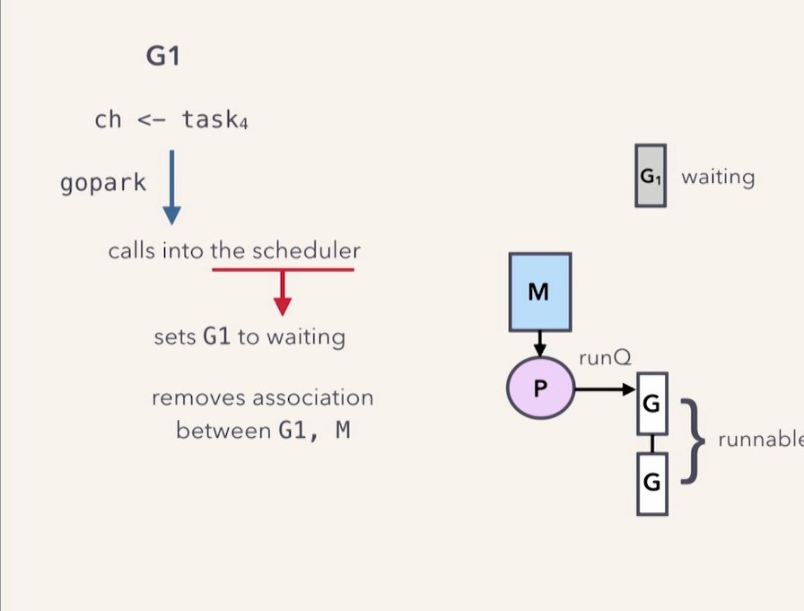
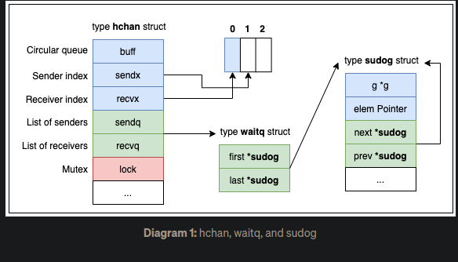
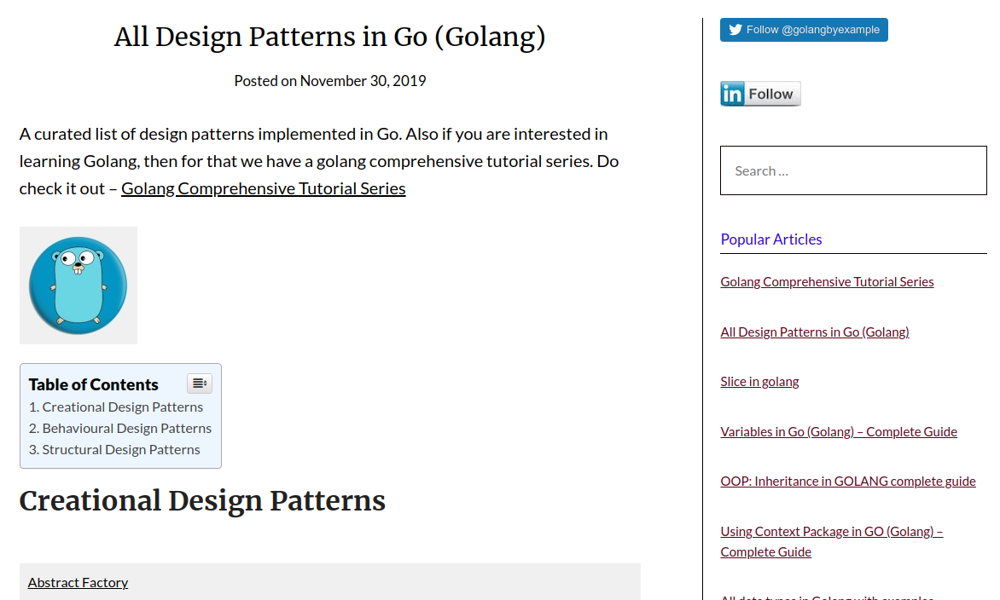
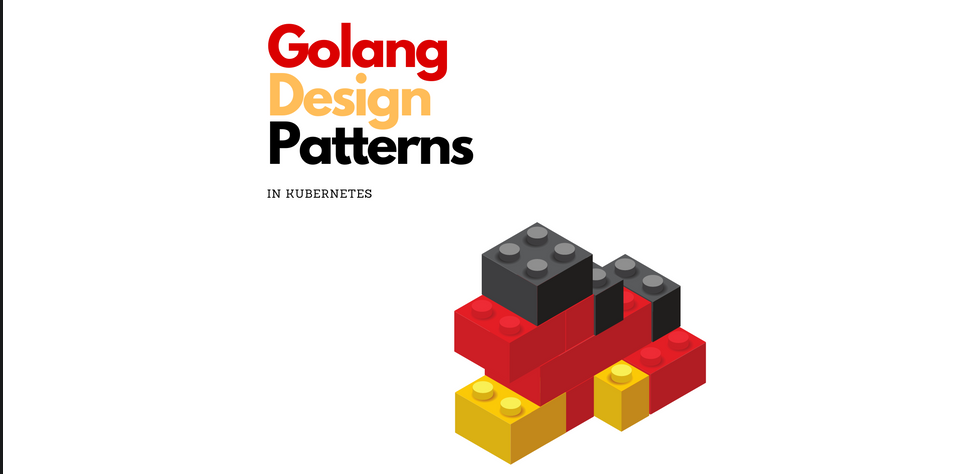

 # Golang related resources and more.
---
 ## 1. [Golang buffered channels internals](https://www.youtube.com/watch?v=KBZlN0izeiY)- A fairly decent peek into how context switching of go routines take place, what the channel struct actually is and why a cross-stack writes in channels is allowed for purposes of optimizations.

 ## 2. [Go channels](https://stevenrojasl.medium.com/go-channels-behind-the-scenes-1cce6b1fa844)- If you prefer articles over videos, read this article instead of the above video. Basically the same exact content.

 ## 3. [Go Design patterns](https://stevenrojasl.medium.com/go-channels-behind-the-scenes-1cce6b1fa844)- Implementation of different design patterns in go.

## 4. [Go Design patterns and their implementation in GO](https://aly.arriqaaq.com/golang-design-patterns/)- Implementation of creational and behavioral patterns in go with some code snipppets from k8s. 

