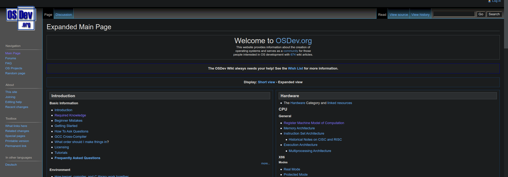

# Operating system related resources and extracts.
---
## 1. [OS wiki dev](https://wiki.osdev.org/) -Encyclopedia of all OS concepts.

## 2. [Socket API](youtube.com/watch?v=XXfdzwEsxFk) - A good starter at understanding how networking takes place in terms of system calls under the OS.

