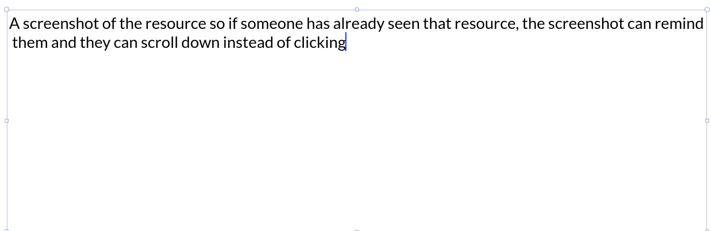

### This repository contains links to all the important & useful resources that I find from ds-algo ,to software development ,to Devops ,networking,OS, Physics, Maths, pretty much everything. 
## If you know any very obscurely good/to-be seen resources, please contribute here. Do not add generic/cliched resource. Try to be specific. If the topic in which you want to contribute doesn't exist. Add a new markdown file.
Resource = Blog | Talk | a part of docs | your own content | Youtube video | ...
### Format is:-
---
# The heading of the markdown. (in case you are adding a new file)
## (i is index)i. [Link of the Resource](https://jscomplete.com/learn/node-beyond-basics) - Few Details

(optional)

---