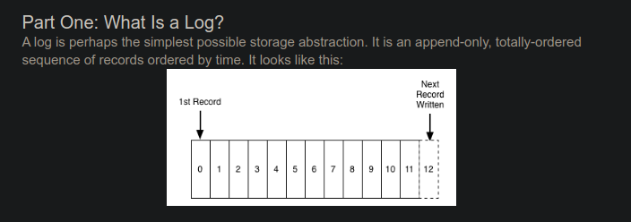

# Good content on distributed systems
---
## 1. [All about Logs](https://engineering.linkedin.com/distributed-systems/log-what-every-software-engineer-should-know-about-real-time-datas-unifying) - A good introduction to what and why are logs in distributed systems. Blog post of engineering.linkedin
