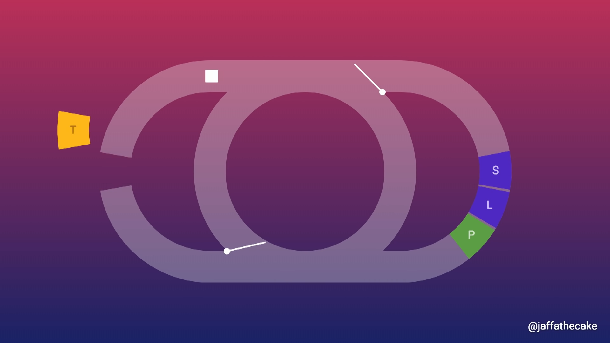

# JS related resources and extracts.
---
## 1. [NodeJS -Beyond the basics by Samer Buna](https://jscomplete.com/learn/node-beyond-basics) - A comprehensive NodeJs tour with good overview of internals.

## 2. [Lifecycle Diagram of react components](https://projects.wojtekmaj.pl/react-lifecycle-methods-diagram/)

## 3. [Introducing hooks](https://www.youtube.com/watch?v=dpw9EHDh2bM&t=511s)- Dan Abramov introducing React Hooks in React conf 2018

## 4. [Introduction to redux by Dan Abramov](https://egghead.io/courses/fundamentals-of-redux-course-from-dan-abramov-bd5cc867)- Dan Abramov,the creator of redux introducing Redux in the simplest, most eloquent way possible. This short course is better than any youtube tutorial out there.

## 4. [Event Loop: Not So Single Threaded](https://www.youtube.com/watch?v=zphcsoSJMvM)- A decent explaination of when nodejs act single threaded and when it does not.

## 5. [Event Loop ](https://www.youtube.com/watch?v=8aGhZQkoFbQ)- Sweet explaination of event loop on the browser for beginners.(Same for the node,except instead of WebAPI's ,we have C++ API's in node which can themselves spawn more threads)

## 6. [In the Event Loop ](https://www.youtube.com/watch?v=cCOL7MC4Pl0)- Order of execution in Event Loop. Promises using microtasks,animation callbacks and a good quiz at the end to clear the concepts. Overall an insightful talk. (Except for the bit where he tries to crack jokes but tough audience man!!)
