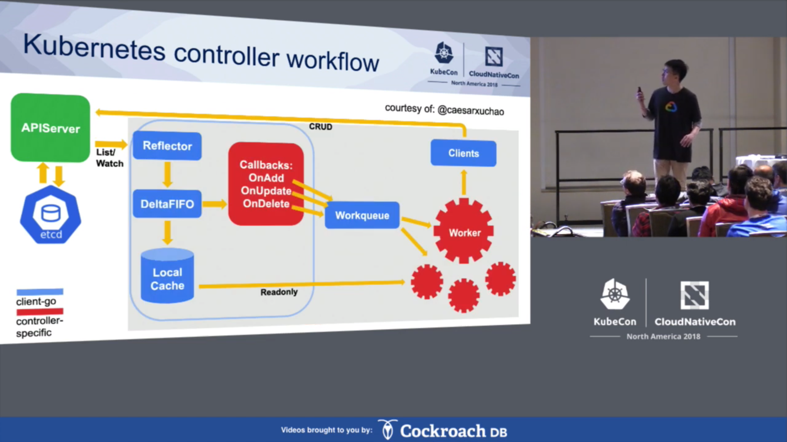

 # Kubernetes, Docker and other CNCF project related resources and more.
---
 ##  [Kubernetes Deconstructed- A high level overview](https://vimeo.com/245778144/4d1d597c5e)- Probably one of the best talks on kubernetes.

***
##  [A good overview of networking in k8 with examples](https://www.youtube.com/watch?v=0Omvgd7Hg1I)- Knowing the basics of kubernetes is a pre-requisite.

***

##  [Kubernetes networking and CNI](https://www.youtube.com/playlist?list=PL36qiA-FGdl7n9AKDv1-r18boL9Er57Gk)- Starting from networking basic, he goes through a hands on demo of what CNI does and then how.

***

##  [Linux namespaces, cgroups and more](https://www.youtube.com/watch?v=x1npPrzyKfs)- If you have a basic knowledge of container technology, this is a deep dive in how it is made possible via cgroups, namespaces and union file systems. And a little about container runtimes and OCI as well.

***

##  [Container networking](https://iximiuz.com/en/posts/container-networking-is-simple/)- Probably, THE BEST article I have read explaining networking in containers.Everything from creating veth pair to establishing successfull communication among network namespaces via bridges. This article is gold. Also this entire [blog](https://iximiuz.com) is gold for anyone interested in cloud native buzzwords.

***

##  [Life of a packet through istio](https://www.youtube.com/watch?v=cB611FtjHcQ)- If you have a good idea of kubernetes, especially how networking in kubernetes work, and also have a little idea of what service meshes are, this video is a great deep dive.

***

##  [Life of kubernetes watch event](https://www.youtube.com/watch?v=PLSDvFjR9HY)- Watch this before writing custom controllers in kubernetes to understand how the events propogate.

***

##  [Admission Controllers in k8](https://kubernetes.io/blog/2019/03/21/a-guide-to-kubernetes-admission-controllers/)- A good overview blog on how to configure custom webhooks and admssion controllers for incoming CRD's.

***

##  [Demo of Istio features](https://www.youtube.com/watch?v=7cINRP0BFY8)- A good starter demo of Virtual service/Destination rules/ingress/egress in istio.

##  [Introduction to Envoy](https://tetrate-academy.thinkific.com/courses/take/envoy-fundamentals/)- A good starter course to understand envoy fundamentals.

