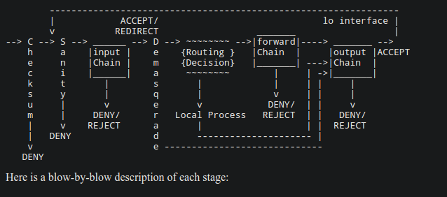
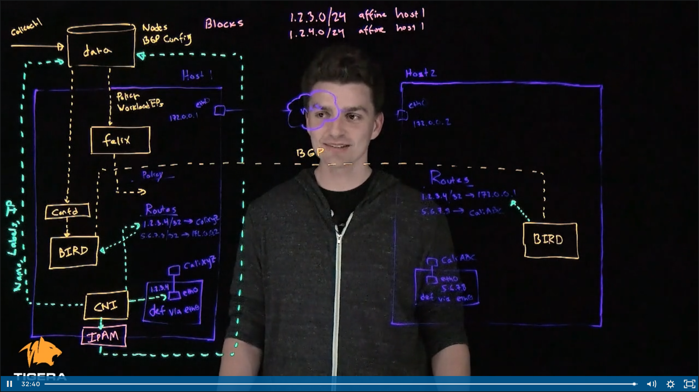

# Linux networking related stuff

 ##  [Packet filtering](https://tldp.org/HOWTO/IPCHAINS-HOWTO-4.html) - How packets are filtered as they go through firewall chains
 

***

 ##  [Basics of Calico CNI](https://www.tigera.io/video/tigera-calico-fundamentals/) - How calico sets up networking between pod-to-node and node-to-node with each of its components.
 

 